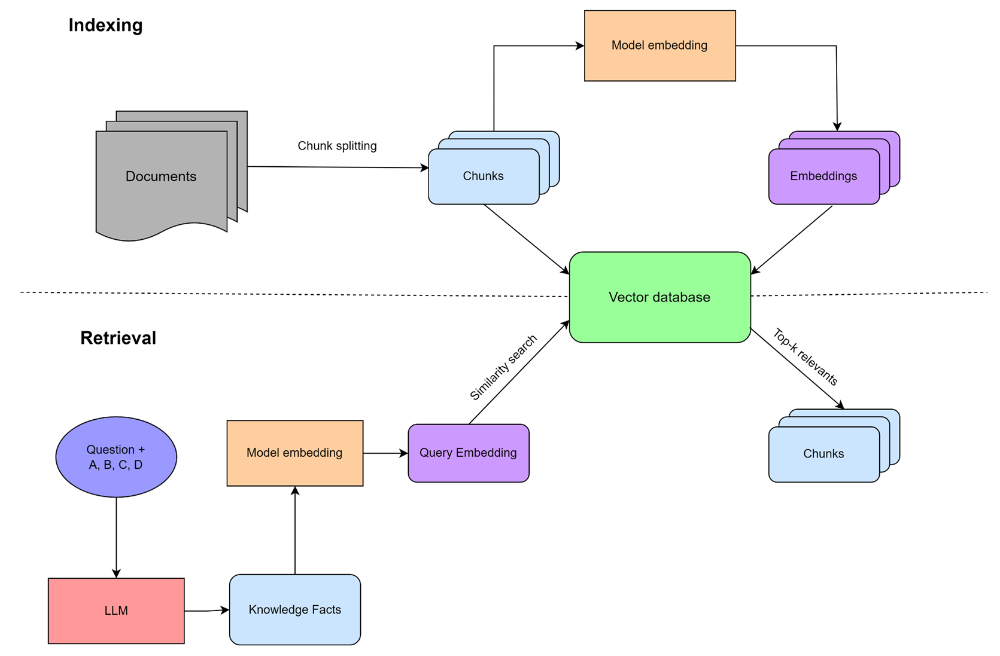
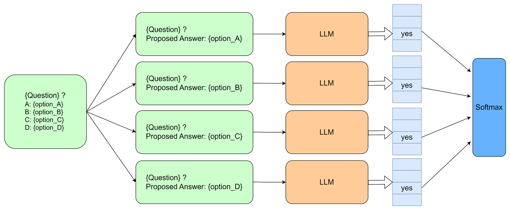

# LLM for MCQA with Enhanced-query RAG

This repository contains experiments utilizing large language models (LLMs) for Multiple Choice Question Answering (MCQA) tasks, incorporating an enhanced Retrieval-Augmented Generation (RAG) approach.

## Architecture

The architecture follows the standard RAG setup, where each document is chunked and represented as embedding vectors. When a query is made, the system searches through the index to retrieve the most relevant chunks, which are then used to enhance the answer.

The key difference lies in the improved query mechanism. Instead of using the raw question for retrieval, the system leverages an LLM to generate relevant knowledge facts, which are then used to form more effective queries, improving search accuracy in the vector database.

## Prediction Approach

The approach avoids not simply using the output logits of label tokens ("A", "B", "C", "D", etc.) as in the baseline method. Instead, it focuses on the logit output of a single token, specifically the "yes" token in this case.

For each question with \( k \) choices, the system transforms them into \( k \) corresponding prompts, each consisting of the question and one possible answer. The LLM’s output logit for the first token position is evaluated, and the logit value for the "yes" token is used to represent the model's agreement with each choice. The logits from these prompts are then compared and normalized using the softmax function to determine the probabilities for each option.

## Models
- **LLama2 - 7B** ([link](https://huggingface.co/meta-llama/Llama-2-7b))
- **Mistral - 7B** ([link](https://huggingface.co/mistralai/Mistral-7B-v0.1))

## Dataset
- **ARC (AI2 Reasoning Challenge)**: A challenging MCQA dataset for evaluating reasoning.  
  Dataset link: [ARC Dataset](https://huggingface.co/datasets/allenai/ai2_arc)

## RAG Setup
In this project, we use a **Retrieval-Augmented Generation (RAG)** approach, combining an LLM with a vector database for document retrieval. The database, built using **FAISS**, indexes Wikipedia chunks split into 100 tokens each, allowing fast similarity search based on vector representations.

- **Vector Database**: Created using FAISS to efficiently search document chunks based on their similarity to the query vector.  
  [Database Link](https://huggingface.co/datasets/dpquoc/wiki-faiss-index)

- **Enhanced Query**: Instead of using the raw question, the LLM generates a knowledge-enhanced query for more accurate retrieval.

- **Embedding Model**: A BERT-based embedding model converts text into vectors, facilitating retrieval.  
  [Embedding Model Link](https://huggingface.co/BAAI/bge-small-en-v1.5)

This setup enhances MCQA by improving the relevance of retrieved documents, leading to better context for answer generation.
